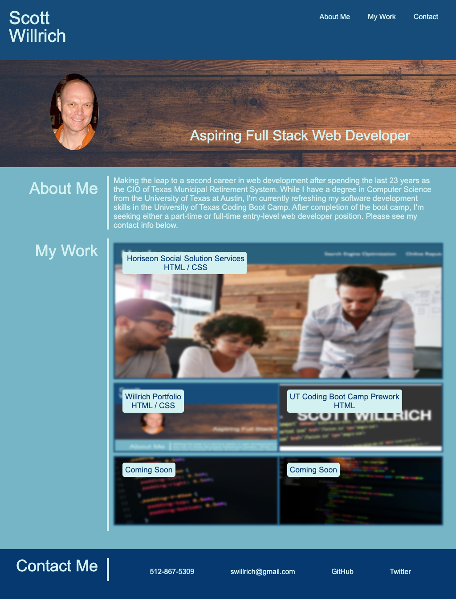

# willrich-portfolio

willrich-portfolio is a website that hosts my portfolio (Scott Willrich)

## GitHub

https://github.com/swillrich5/willrich-portfolio

## User Story
```
AS AN employer
I WANT to view a potential employee's deployed portfolio of work samples
SO THAT I can review samples of their work and assess whether they're a good candidate for an open position
```
## Requirements

### Portfolio must include:
* The developer's name
* A recent photo
* Links to sections about the developer, their work, and their contact information.
* The aformention links, when clicked, will scroll the user to the corresponding section of the porfolio.
* The first qpplication listed should appear larger in size than the other applications.
* When the user clicks on the application image, they are taken to the deployed application.
* The page resizes as appropriate for devices with differeent screen sizes (PCs, tables, smartphones).  In other words, the page is responsive.
* The portfolio page must be deployed at a live URL and loads with no errors.
* The application should resemble the mock-up functionality provided.
* The code respository should:

  * Have a unique name
  * Follow best practices for file structure and naming conventions
  * Follow best practices for class/id naming conventions, indentation, quality comments, etc.
  * Repository contains a quality README (this file).

## Wireframe Mock-Up


## Image of Deployed Application

